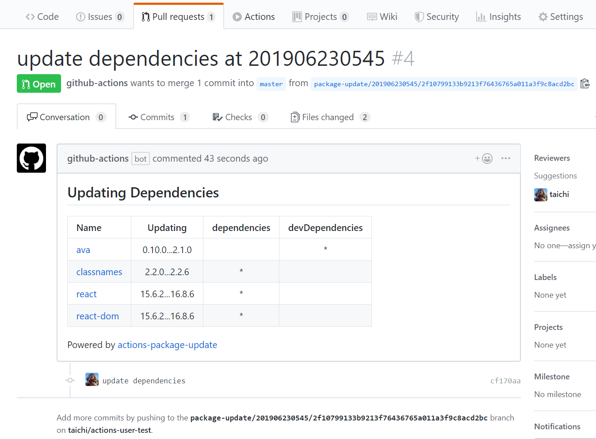

# actions-package-update

This tool keeps npm dependencies up-to-date by making pull requests from GitHub Actions or CI.



This tool successor of [taichi/ci-yarn-upgrade](https://github.com/taichi/ci-yarn-upgrade).

# Basic Usage
GitHub Action for package.json update.

## GitHub Actions

below is the complete workflow example.

```
workflow "Update" {
  on = "schedule(0 0 * * 3)"
  resolves = ["package-update"]
}

action "package-update" {
  uses = "taichi/actions-package-update@master"
  args = "-u --packageFile package.json"
  env  = {
    AUTHOR_NAME = "John"
    AUTHOR_EMAIL = "john@example.com"
    EXECUTE = "true"
  }
  secrets = ["GITHUB_TOKEN"]
}
```

* this workflow works every wednesday at 0:00
* all `args` are pass to [npm-check-updates](https://github.com/tjunnone/npm-check-updates)
* `AUTHOR_NAME` and `AUTHOR_EMAIL` is use for commit.
* if you define `EXECUTE` is true, then actions-package-update makes a Pull Request.
* you must grant acess to `GITHUB_TOKEN`, because actions-package-update access to your repository and make Pull Request.
  * see. https://developer.github.com/actions/managing-workflows/storing-secrets/

### Examples

* Update devDependencies only

```
action "package-update" {
  uses = "taichi/actions-package-update@master"
  args = "-u --packageFile package.json --dep dev"
  env  = {
    AUTHOR_NAME = "John"
    AUTHOR_EMAIL = "john@example.com"
    EXECUTE = "true"
  }
  secrets = ["GITHUB_TOKEN"]
}
```

* Use yarn upgrade

```
action "package-update" {
  uses = "taichi/actions-package-update@master"
  args = "upgrade --latest"
  env  = {
    AUTHOR_NAME = "John"
    AUTHOR_EMAIL = "john@example.com"
    EXECUTE = "true"
    UPDATE_COMMAND="yarn"
  }
  secrets = ["GITHUB_TOKEN"]
}
```

* Use npm update

```
action "package-update" {
  uses = "taichi/actions-package-update@master"
  args = "update"
  env  = {
    AUTHOR_NAME = "John"
    AUTHOR_EMAIL = "john@example.com"
    EXECUTE = "true"
    UPDATE_COMMAND="npm"
  }
  secrets = ["GITHUB_TOKEN"]
}
```

## Local or CI Server|Service

### Install

    yarn global add actions-package-update

or

    npm install actions-package-update -g


### Setting Environment Variables

* Required Variables
  * `GITHUB_TOKEN`
    * GitHub personal access token is required for sending pull requests to your repository
    * [Creating an access token for command-line use](https://help.github.com/en/articles/creating-a-personal-access-token-for-the-command-line)
  * `AUTHOR_NAME` and `AUTHOR_EMAIL` 
    * this command use there variables for commit
  * `EXECUTE`
    * By default, actions-package-update runs in dry-run mode.
    * if you set to `EXECUTE=true`, then this command push branch to remote, and make a pull request.

### Command Behavior

this command works locally and output result to standard output.


# Optional Configurations

* `BRANCH_PREFIX`
  * specify working branch prefix. default prefix is `package-update/`.
* `COMMIT_MESSAGE`
  * specify the commit message. default message is `update dependencies`.
* `UPDATE_COMMAND`
  * specify the command for update. default command is `ncu`.
    * for example, you may set to `yarn` or `npm`.
* `WITH_SHADOWS`
  * if you specify this option, shows shadow dependencies changes.
  * default value is `false`.
* `KEEP`
  * if you specify this option, keep working branch after all.
  * default value is `false`.
  * this is usefull for debug.
* `LOG_LEVEL`
  * One of `fatal`, `error`, `warn`, `info`, `debug`, `trace` or `silent`.
  * default value is `info`.
  * if you want to know this tool's internal states, set to `debug`.
* `GITHUB_WORKSPACE`
  * specify the working dir.
  * default value is `./`.
  * if you use this tool as GitHub Actions, setting valid value automatically.

# for developers
## setup
execute below commands on project root dir.

    yarn install
    code .

## release

* release package to npmjs
  
    yarn publish

* edit Dockerfile
